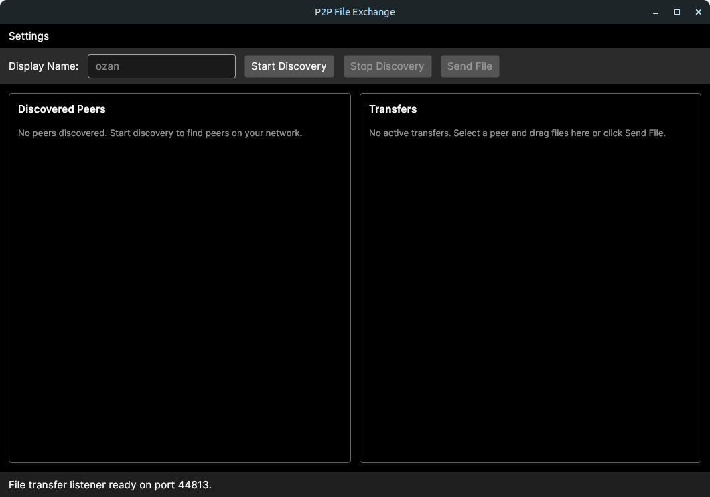
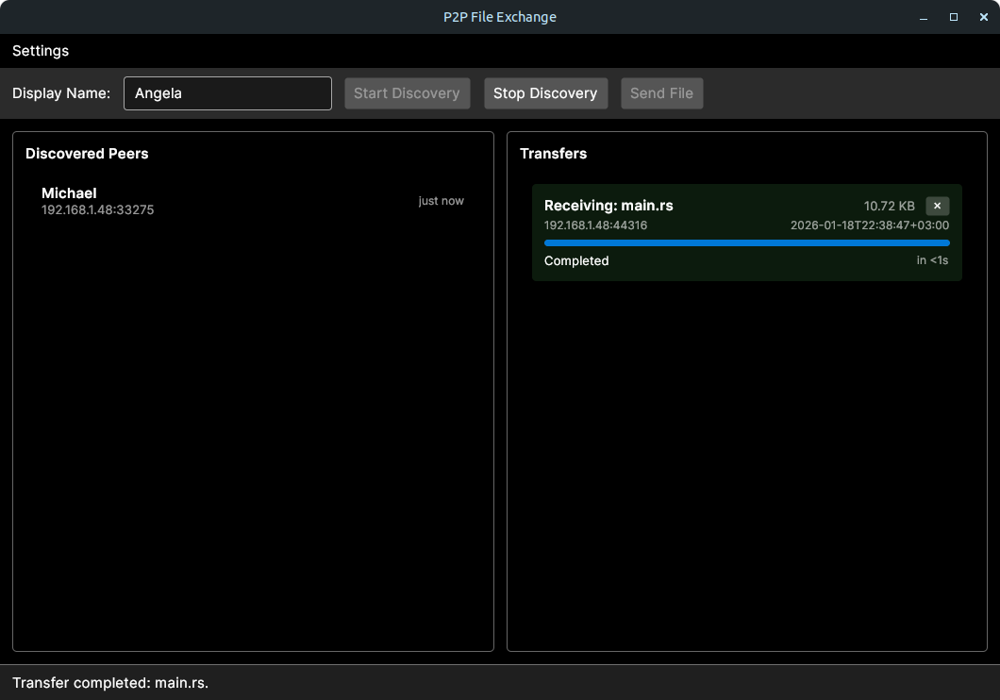

# P2P File Exchange

Peer-to-peer file transfer app for local networks. It discovers peers via UDP
broadcast and sends files over TCP with per-chunk integrity checks,
all accessible through a cross-platform desktop UI built with Avalonia.

## Features

- Automatic peer discovery on the local network
- ECDSA-signed discovery broadcasts to prevent peer impersonation
- TLS-encrypted file transfers with certificate pinning
- Per-chunk SHA-256 integrity validation
- Drag-and-drop or file picker sending
- Transfer progress, speed, and ETA tracking
- Automatic download folder and collision-safe file naming

## Screenshots




> [!NOTE]
> Peer discovery uses UDP broadcast, so devices must be on the same LAN.

## Requirements

- .NET SDK 10.0

## Quick Start

```bash
dotnet restore
dotnet run --project src/P2PFileExchange.Desktop
```

Run the app on two machines on the same network, start discovery, and send files
between peers.

## Default Download Location

Inbound files are saved to:

```text
~/Downloads/P2PFileExchange
```

## Network Details

- UDP broadcast port: `37020`
- TCP listener port: dynamic (assigned at runtime)

> [!NOTE]
> If discovery or transfers do not work, ensure UDP broadcast and TCP traffic
> are allowed by your firewall.

## Security

### TLS Encryption

All file transfers use TLS encryption with self-signed certificates. On first
run, a certificate is generated and saved to:

```text
~/.config/P2PFileExchange/peer.pfx    (Linux)
%APPDATA%\P2PFileExchange\peer.pfx    (Windows)
```

Certificate fingerprints are exchanged during peer discovery and verified during
TLS handshake to prevent man-in-the-middle attacks.

### Discovery Signing

Peer discovery broadcasts are authenticated using ECDSA (P-256) signatures. On
first launch, a signing keypair is generated and saved alongside the certificate:

```text
~/.config/P2PFileExchange/signing.key    (Linux)
%APPDATA%\P2PFileExchange\signing.key    (Windows)
```

Each discovery message includes:

- Peer ID, display name, IP address, and TCP port
- Certificate fingerprint
- The sender's ECDSA public key
- A signature over PeerId + DisplayName + TcpPort + CertificateFingerprint

Receivers verify the signature before trusting the announcement. Messages with
invalid signatures are discarded, preventing peer impersonation on the network.

Trusted discovery keys follow a trust-on-first-use (TOFU) model for the current
session only. Other peers' ECDSA public keys are cached in memory and are not persisted across
restarts by default.

## Project Layout

- `src/P2PFileExchange.Core`: discovery, protocol, and transfer logic
- `src/P2PFileExchange.Desktop`: Avalonia UI client
