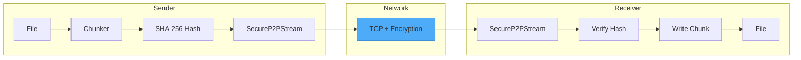
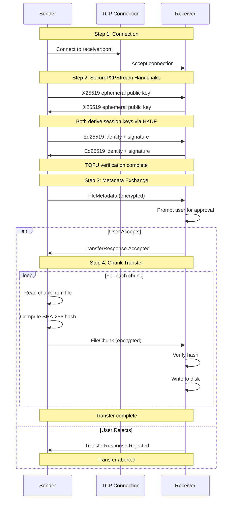
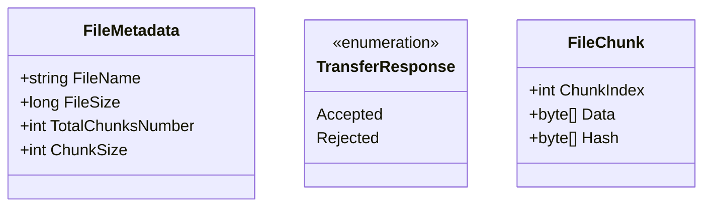
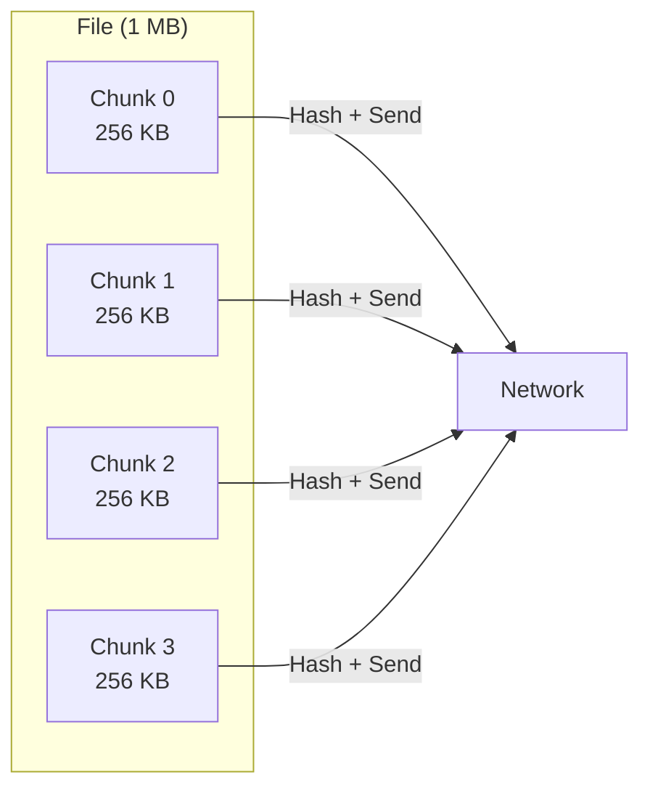
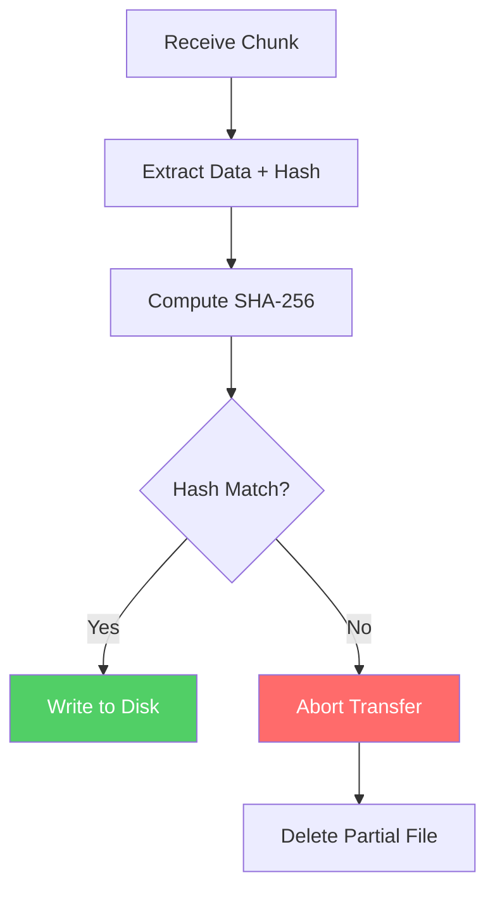
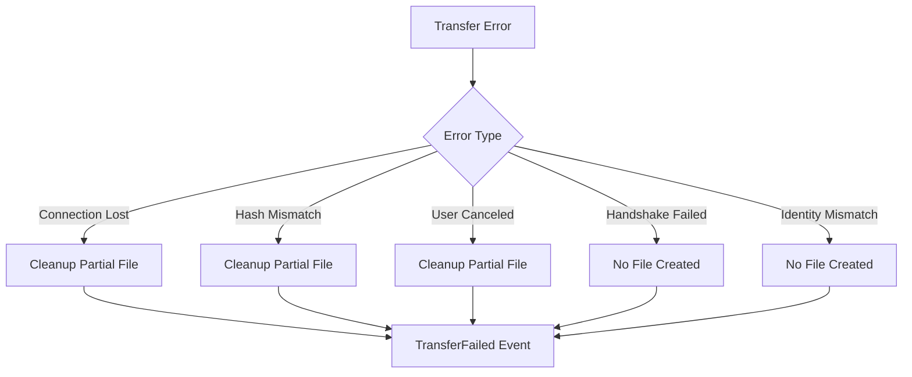
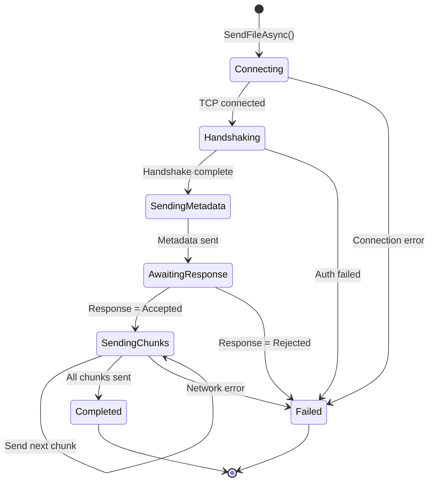
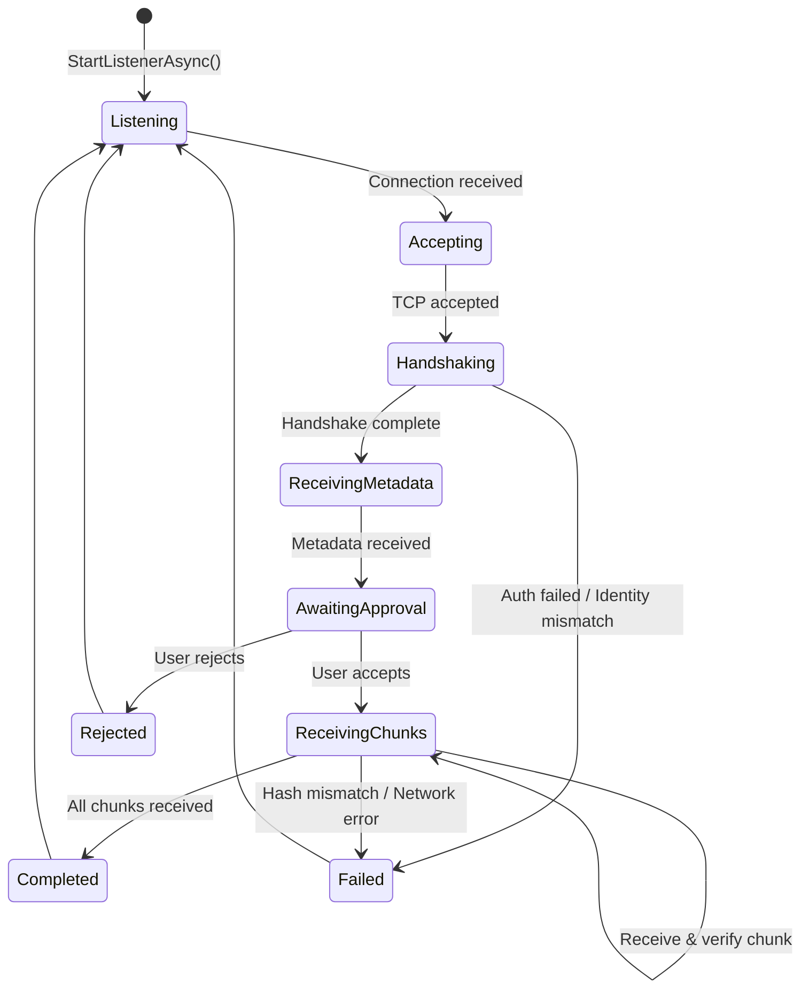
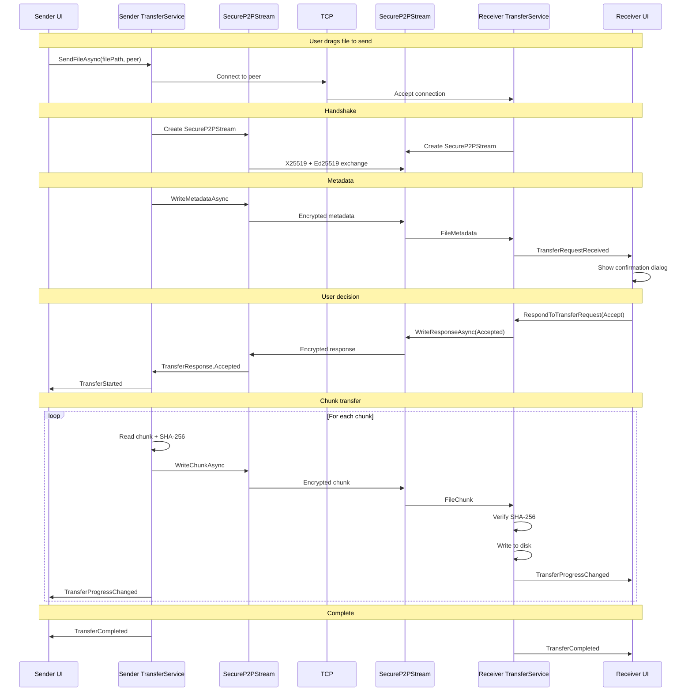

# File Transfer Protocol

This document describes how P2P File Exchange transfers files between peers over encrypted TCP connections.

## Overview

File transfers use **TCP** with a custom encrypted transport layer (`SecureP2PStream`) that provides:

- X25519 key exchange for forward secrecy
- ChaCha20-Poly1305 authenticated encryption
- Ed25519 mutual authentication
- Per-chunk SHA-256 integrity verification



## Transfer Flow



## Protocol Messages

### Message Types

All messages are serialized as JSON and encrypted via `SecureP2PStream`.



### FileMetadata

Sent by the sender immediately after handshake:

```json
{
  "fileName": "document.pdf",
  "fileSize": 1048576,
  "totalChunksNumber": 4,
  "chunkSize": 262144
}
```

| Field | Type | Description |
|-------|------|-------------|
| `fileName` | string | Original filename (sanitized on receive) |
| `fileSize` | int64 | Total file size in bytes |
| `totalChunksNumber` | int32 | Number of chunks |
| `chunkSize` | int32 | Size of each chunk (default: 256 KB) |

### TransferResponse

Sent by receiver after user prompt:

```json
{
  "response": 0
}
```

| Value | Meaning |
|-------|---------|
| 0 | Accepted |
| 1 | Rejected |

### FileChunk

Sent for each chunk of the file:

```json
{
  "chunkIndex": 0,
  "data": "Base64EncodedData",
  "hash": "Base64SHA256Hash"
}
```

| Field | Type | Description |
|-------|------|-------------|
| `chunkIndex` | int32 | Zero-based chunk index |
| `data` | Base64 | Chunk bytes |
| `hash` | Base64 | SHA-256 hash of data (32 bytes) |

## Chunking Strategy

Files are split into fixed-size chunks for streaming transfer:



### Chunk Parameters

| Parameter | Default | Description |
|-----------|---------|-------------|
| Chunk Size | 256 KB | Maximum bytes per chunk |
| Buffer Size | 64 KB | File I/O buffer size |

### Chunk Count Calculation

```math
totalChunks = \lceil \frac{fileSize}{chunkSize} \rceil
```

### Last Chunk Handling

The last chunk may be smaller than `chunkSize`. The actual size is determined by the `data` field length.

## Integrity Verification



### Verification Steps

1. Receiver computes `SHA256(chunk.data)`
2. Compare with `chunk.hash` using constant-time comparison
3. On mismatch: abort transfer, delete partial file
4. On match: write chunk to disk

## Filename Handling

### Sanitization

Received filenames are sanitized to prevent path traversal:

```csharp
// Dangerous: "../../../etc/passwd"
// Safe: "passwd"

fileName = Path.GetFileName(fileName);  // Remove path components
```

### Collision Handling

If the target file exists, a counter is appended:

```text
document.pdf    -> document.pdf
document.pdf    -> document (1).pdf
document.pdf    -> document (2).pdf
```

### Download Directory

Default location:

```sh
~/Downloads/P2PFileExchange/  (Linux)
%USERPROFILE%\Downloads\P2PFileExchange\  (Windows)
```

## Error Handling

### Transfer Failures



### Partial File Cleanup

If a transfer fails after some chunks were written:

1. Close file handle
2. Delete partial file from disk
3. Fire `TransferFailed` event with error message

## Events

The transfer service emits events for UI updates:

| Event | Payload | Trigger |
|-------|---------|---------|
| `TransferRequestReceived` | `TransferRequestEventArgs` | Incoming transfer request (prompts user) |
| `TransferStarted` | `TransferStartedEventArgs` | Transfer begins (metadata exchanged) |
| `TransferProgressChanged` | `TransferProgressEventArgs` | Chunk transferred (progress update) |
| `TransferCompleted` | `TransferCompletedEventArgs` | Transfer finished successfully |
| `TransferFailed` | `TransferFailedEventArgs` | Transfer failed (with error message) |

### Progress Calculation

```math
progressPercentage = \frac{chunksReceived}{totalChunks} \times 100
```

## Sender-Side Flow



## Receiver-Side Flow



## Configuration

### FileTransferOptions

```csharp
public sealed class FileTransferOptions
{
    public int ChunkSize { get; set; } = 256 * 1024;      // 256 KB
    public int BufferSize { get; set; } = 64 * 1024;      // 64 KB
    public TimeSpan TlsHandshakeTimeout { get; set; } = TimeSpan.FromSeconds(10);
}
```

## Network Requirements

### Firewall Rules

```text
TCP Inbound:  Dynamic port (assigned at runtime)
TCP Outbound: Peer's TCP port (from discovery)
```

### Port Assignment

The receiver binds to port 0, letting the OS assign an available port. This port is broadcast via discovery announcements.

## Wire Format

### Encrypted Frame Structure

All protocol messages are wrapped in `SecureP2PStream` frames:

```text
┌─────────────────────────────────────────────────────────────┐
│                    SecureP2PStream Frame                    │
├────────────────┬────────────────┬───────────────────────────┤
│ Frame Number   │ Length         │ Ciphertext + Tag          │
│ (8 bytes)      │ (2 bytes)      │ (JSON + 16 byte tag)      │
└────────────────┴────────────────┴───────────────────────────┘
```

### Message Framing

Each protocol message (metadata, response, chunk) is:

1. Serialized to JSON
2. Encrypted with ChaCha20-Poly1305
3. Sent as one or more frames (max 16 KB payload per frame)

## Sequence Diagram: Complete Transfer


