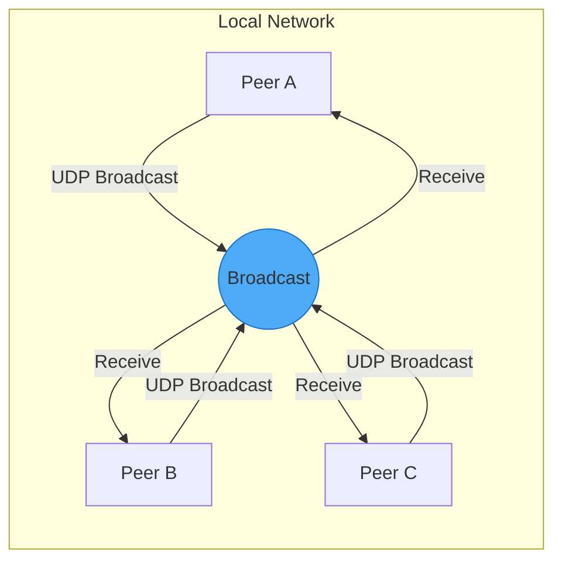
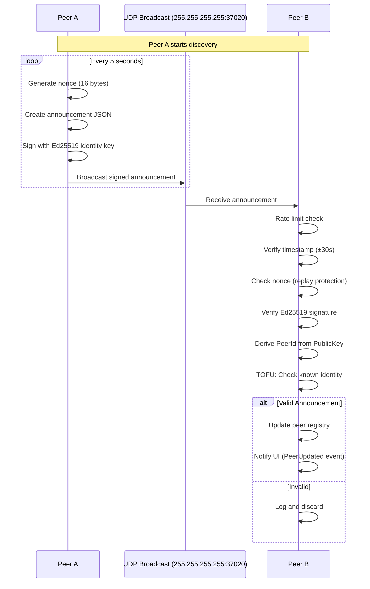
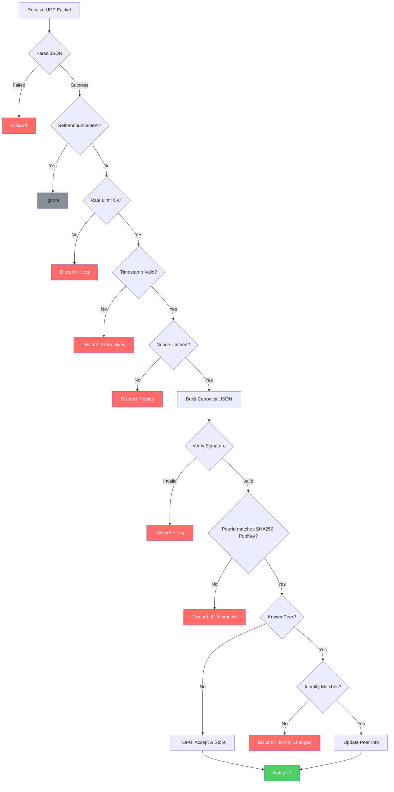
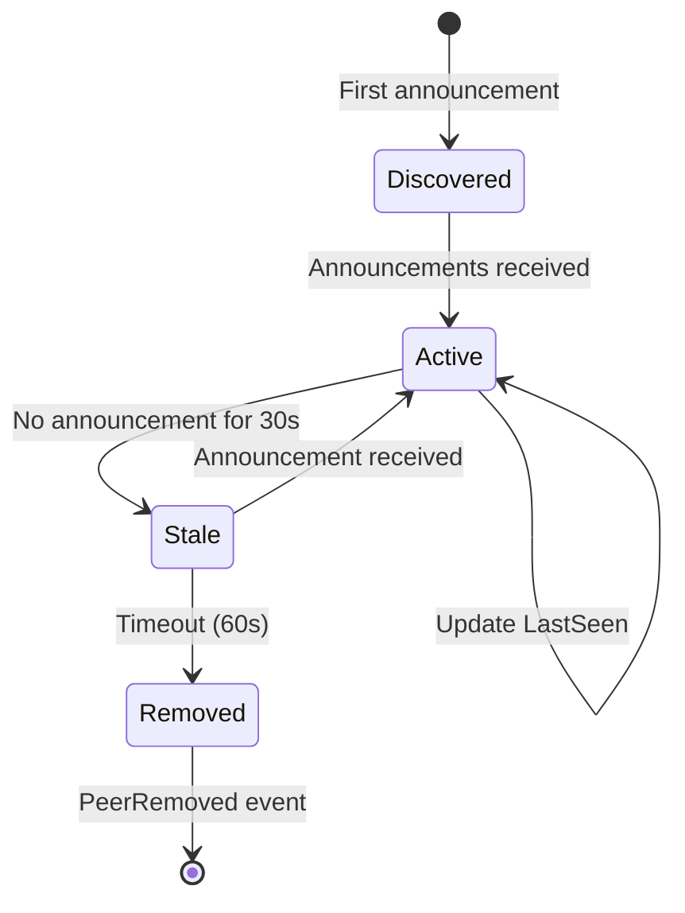
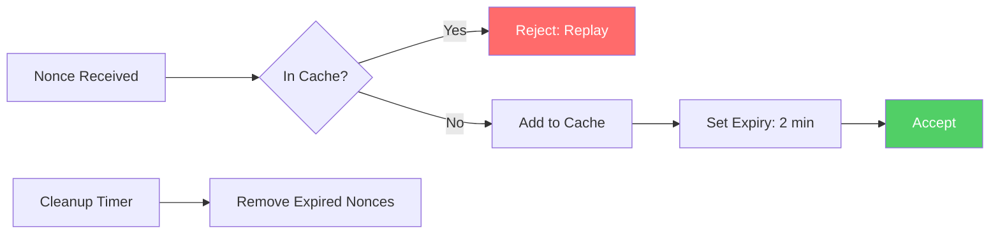
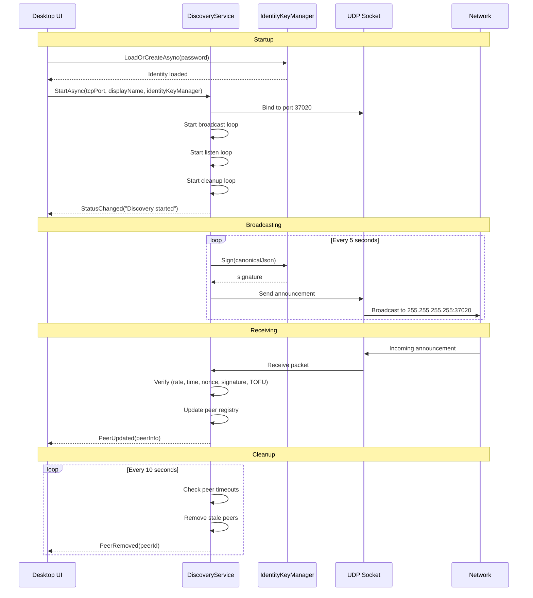

# Peer Discovery Protocol

This document describes how P2P File Exchange discovers peers on the local network using authenticated UDP broadcasts.

## Overview

Peer discovery uses **UDP broadcast** on port `37020` to announce presence and discover other peers on the same LAN. All announcements are **Ed25519 signed** to prevent peer impersonation.



## Protocol Flow



## Announcement Message Format

### JSON Structure

```json
{
  "peerId": "f3a7b82c-91d4-4e6f-a2c8-a4e917b3d6f2",
  "displayName": "Alice's PC",
  "ipAddress": "192.168.1.100",
  "tcpPort": 45678,
  "publicKey": "Base64(Ed25519PublicKey)",
  "timestamp": 1706745600,
  "nonce": "Base64(16RandomBytes)",
  "signature": "Base64(Ed25519Signature)"
}
```

### Field Descriptions

| Field | Type | Description |
|-------|------|-------------|
| `peerId` | GUID | Derived from SHA-256(publicKey)\[0:16] |
| `displayName` | string | Human-readable peer name |
| `ipAddress` | string | IPv4 address of the sender |
| `tcpPort` | uint16 | TCP port for file transfers |
| `publicKey` | Base64 | Ed25519 public key (32 bytes) |
| `timestamp` | int64 | Unix timestamp (seconds) |
| `nonce` | Base64 | Random 16-byte nonce |
| `signature` | Base64 | Ed25519 signature (64 bytes) |

### Signature Computation

The signature covers a **canonical JSON** representation (sorted keys, no whitespace):

```csharp
canonical_json = {
    "displayName": "Alice's PC",
    "ipAddress": "192.168.1.100", 
    "nonce": "Base64Nonce",
    "peerId": "f3a7b82c-91d4-4e6f-a2c8-a4e917b3d6f2",
    "publicKey": "Base64PublicKey",
    "tcpPort": 45678,
    "timestamp": 1706745600
}

signature = Ed25519.Sign(identity_private_key, UTF8(canonical_json))
```

## Verification Process



### Verification Steps

1. **Rate Limiting**: Max 30 announcements per peer per minute
2. **Timestamp Check**: Must be within ±30 seconds of local time
3. **Nonce Check**: Nonces are cached for 2 minutes to prevent replay
4. **Signature Verification**: Ed25519 signature over canonical JSON
5. **PeerId Derivation**: Verify `peerId == SHA256(publicKey)[0:16]`
6. **TOFU Check**: If peer known, identity must match stored key

## Peer Registry

Discovered peers are stored in a thread-safe dictionary:

```csharp
ConcurrentDictionary<Guid, PeerInfo> m_peers
```

### PeerInfo Structure

```csharp
public sealed class PeerInfo
{
    public Guid PeerId { get; set; }
    public string DisplayName { get; set; }
    public IPAddress IPAddress { get; set; }
    public ushort TcpPort { get; set; }
    public DateTimeOffset LastSeen { get; set; }
    public string IdentityPublicKey { get; set; }      // Base64
    public string IdentityFingerprint { get; set; }    // Human-readable
    public TrustedPeerInfo? TrustInfo { get; set; }    // From trust DB
}
```

## Peer Lifecycle



### Timeouts

| Parameter | Default Value | Description |
|-----------|---------------|-------------|
| Broadcast Interval | 5 seconds | How often to send announcements |
| Peer Timeout | 30 seconds | Mark peer as stale |
| Cleanup Interval | 10 seconds | How often to check for stale peers |
| Deduplication Window | 10 seconds | Ignore duplicate announcements |

## Security Measures

### Anti-Replay Protection



### Rate Limiting

```text
Per-Peer Rate Limit:
  - Window: 1 minute (sliding)
  - Max announcements: 30
  - Action on exceed: Discard + log
```

### Timestamp Validation

```math
Valid if: |local_time - announcement_time| \leq 30 \text{ seconds}
```

This prevents attackers from replaying old captured announcements.

## Events

The discovery service emits events for UI updates:

| Event | Payload | Trigger |
|-------|---------|---------|
| `PeerUpdated` | `PeerInfo` | New peer discovered or existing peer updated |
| `PeerRemoved` | `Guid` (PeerId) | Peer timed out and removed |
| `StatusChanged` | `string` | Discovery started/stopped, errors |

## Configuration

### PeerDiscoveryOptions

```csharp
public sealed class PeerDiscoveryOptions
{
    public ushort BroadcastPort { get; set; } = 37020;
    public IPAddress BroadcastAddress { get; set; } = IPAddress.Broadcast;
    public TimeSpan BroadcastInterval { get; set; } = TimeSpan.FromSeconds(5);
    public TimeSpan PeerTimeout { get; set; } = TimeSpan.FromSeconds(30);
}
```

## Network Requirements

### Firewall Rules

```text
UDP Inbound:  Port 37020 (discovery)
UDP Outbound: Port 37020 (discovery)
```

### Network Topology

Discovery only works on the **same broadcast domain**:

- Same LAN segment
- Same WiFi network
- Bridged network interfaces

**Does NOT work across:**

- Different subnets (unless broadcast relay configured)
- VPNs (unless broadcast enabled)
- Internet

## Sequence Diagram: Full Discovery Flow


