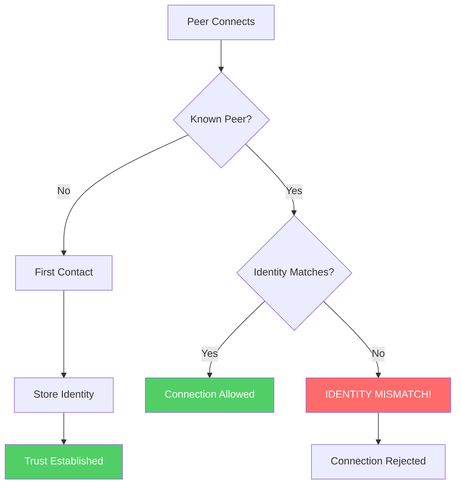
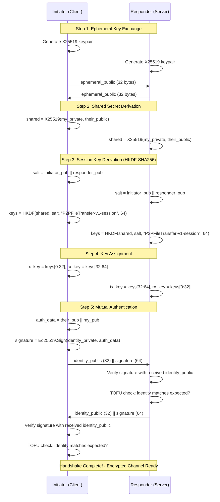

# Security Architecture

This document describes the cryptographic mechanisms and trust model used in P2P File Exchange.

## Overview

P2P File Exchange implements a **zero-trust, end-to-end encrypted** communication model using modern cryptographic primitives:

| Layer | Mechanism | Purpose |
|-------|-----------|---------|
| Identity | Ed25519 | Persistent peer authentication |
| Key Exchange | X25519 | Forward-secret session keys |
| Encryption | ChaCha20-Poly1305 | Authenticated encryption |
| Trust | TOFU (Trust-On-First-Use) | Peer verification |
| Integrity | SHA-256 | Per-chunk file verification |

## Cryptographic Primitives

### Ed25519 Identity Keys

Each peer has a persistent Ed25519 keypair that serves as their cryptographic identity.

```text
┌─────────────────────────────────────────────────────────────┐
│                    Identity Key File                        │
│  (~/.local/share/P2PFileExchange/identity.key)              │
├─────────────────────────────────────────────────────────────┤
│  Salt (32 bytes)           │  Random, per-file              │
│  Nonce (24 bytes)          │  Random, per-encryption        │
│  Ciphertext (64 bytes)     │  XChaCha20-Poly1305 encrypted  │
│  Tag (16 bytes)            │  Authentication tag            │
└─────────────────────────────────────────────────────────────┘
                    Total: 136 bytes
```

**Key Derivation for Encryption at Rest:**

- Algorithm: Argon2id
- Memory: 64 MB
- Iterations: 3
- Parallelism: 4 lanes
- Output: 32-byte key for XChaCha20-Poly1305

**Peer ID Derivation:**

```text
PeerId = first 16 bytes of SHA-256(PublicKey)
```

**Fingerprint Format:**

```text
SHA-256(PublicKey) formatted as: "F3A7 B82C 91D4 E6F5 2C8A 4E91 7B3D 6F2E ..."
```

### X25519 Key Exchange

Every connection uses ephemeral X25519 keypairs for forward secrecy. Even if a peer's long-term identity key is compromised, past sessions remain secure.

### ChaCha20-Poly1305 Encryption

All data after handshake is encrypted using ChaCha20-Poly1305 AEAD:

- 256-bit key
- 96-bit nonce (frame-number based)
- 128-bit authentication tag

## Trust Model: TOFU (Trust-On-First-Use)



### Trust Database Schema

```sql
CREATE TABLE TrustedPeers (
    PeerId TEXT PRIMARY KEY,           -- GUID derived from public key
    PublicKey BLOB NOT NULL,           -- Ed25519 public key (32 bytes)
    Fingerprint TEXT NOT NULL,         -- Human-readable fingerprint
    CachedDisplayName TEXT,            -- Last known display name
    FirstSeenUtc INTEGER NOT NULL,     -- Unix timestamp
    LastSeenUtc INTEGER NOT NULL,      -- Unix timestamp
    TrustLevel INTEGER DEFAULT 1,      -- 0=Blocked, 1=TOFU, 2=Verified
    Notes TEXT                         -- User notes
);
```

### Trust Levels

| Level | Name | Description |
|-------|------|-------------|
| 0 | Blocked | Peer is explicitly blocked |
| 1 | TOFU | Trusted on first use (default) |
| 2 | Verified | Manually verified (e.g., via fingerprint comparison) |

## SecureP2PStream Protocol

The `SecureP2PStream` class provides an encrypted transport layer.

### Handshake Sequence



### Frame Format

After handshake, all data is transmitted in encrypted frames:

```text
┌──────────────────────────────────────────────────────────────┐
│                    Encrypted Frame                           │
├────────────────┬────────────────┬────────────────────────────┤
│ Frame Number   │ Payload Length │ Ciphertext + Tag           │
│ (8 bytes)      │ (2 bytes)      │ (variable + 16 bytes)      │
│ BE u64         │ BE u16         │ ChaCha20-Poly1305          │
└────────────────┴────────────────┴────────────────────────────┘
```

**Replay Protection:**

- Frame numbers are monotonically increasing
- Receiver rejects frames with `frame_number <= last_received`
- Maximum payload size: 16 KB

**Nonce Construction:**

```csharp
nonce[0..8]  = frame_number // big-endian
nonce[8..12] = 0x00000000 // padding
```

## Security Properties

### Forward Secrecy

- Ephemeral X25519 keys are generated per connection
- Session keys are derived from ephemeral shared secret
- Compromising identity keys does not reveal past sessions

### Authentication

- Ed25519 signatures bind ephemeral keys to identity keys
- Prevents man-in-the-middle attacks
- TOFU provides persistent identity verification

### Integrity

- ChaCha20-Poly1305 provides authenticated encryption
- Per-frame authentication tags detect tampering
- Per-chunk SHA-256 hashes verify file integrity

### Replay Protection

- Discovery: Timestamp + nonce prevents replay
- Transfer: Monotonic frame numbers prevent replay

## Security Audit Log

All security-relevant events are logged to an SQLite database:

```sh
~/.local/share/P2PFileExchange/security_audit.db
```

### Event Categories

| Category | Events |
|----------|--------|
| Identity | Generated, Loaded, Unlocked, Locked |
| Discovery | NewPeer, PeerUpdated, SignatureInvalid, PacketDropped |
| Connection | HandshakeStarted, HandshakeComplete, HandshakeFailed, TamperingDetected |
| Transfer | Started, Completed, Failed, Canceled, Rejected |
| Trust | PeerTrusted, PeerUntrusted, TrustRevoked |

### Severity Levels

| Level | Value | Use Case |
|-------|-------|----------|
| Info | 0 | Normal operations |
| Warning | 10 | Potential issues (invalid signatures, rate limiting) |
| Error | 20 | Operation failures |
| Critical | 30 | Security violations (tampering, identity mismatch) |

## Threat Model

### Protected Against

| Threat | Mitigation |
|--------|------------|
| Eavesdropping | ChaCha20-Poly1305 encryption |
| MITM attacks | Ed25519 mutual authentication + TOFU |
| Replay attacks | Timestamps, nonces, frame numbers |
| Peer impersonation | Ed25519 signed discovery |
| Data corruption | SHA-256 per-chunk verification |
| Credential theft | Argon2id key derivation |

### Not Protected Against

| Threat | Reason |
|--------|--------|
| Endpoint compromise | Attacker with local access can extract keys |
| Traffic analysis | Packet sizes/timing are visible |
| First-contact MITM | TOFU trusts first identity seen |
| Denial of service | No built-in DDoS protection |

## File Locations

| File | Path (Linux) | Purpose |
|------|--------------|---------|
| Identity Key | `~/.local/share/P2PFileExchange/identity.key` | Ed25519 keypair (encrypted) |
| Trust Database | `~/.local/share/P2PFileExchange/trust.db` | TOFU peer records |
| Audit Log | `~/.local/share/P2PFileExchange/security_audit.db` | Security event log |

## Implementation Notes

### Libraries Used

- **Sodium.Core**: Ed25519, X25519, ChaCha20-Poly1305, XChaCha20-Poly1305
- **Konscious.Security.Cryptography**: Argon2id
- **Microsoft.Data.Sqlite**: Trust database and audit log

### Key Zeroing

Private keys are securely erased from memory when:

- `IdentityKeyManager.Dispose()` is called
- `IdentityKeyManager.Lock()` is called
- Session keys are cleared after `SecureP2PStream.Dispose()`
